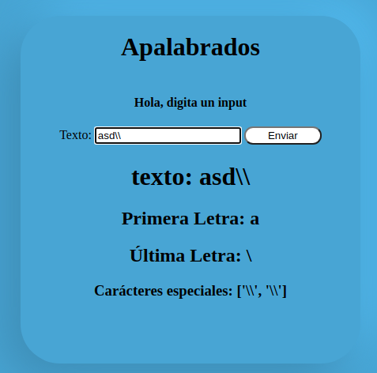
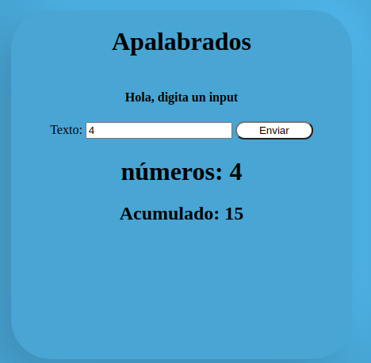

# Apalabrados

Para visualizar el aplicativo dirijete a: [apalabrados.com](https://apalabradosapp.herokuapp.com/ "apalabrados.com")

**Para poder seguir los siguientes pasos necesitas tener instalado python 3.8.*  en tu sistema.**  


# Instalación
- `$ git clone https://github.com/sarmijavier/Apalabrados.git`
-  `$ python -m venv .env`
-  `$ source /venv/bin/activate`
-  `$ pip install -r requeriments.txt`
-  `$ flask run`


# Ejemplo
Una vez habras el aplicativo, vas a encontrar un input, en el cual puedes colocar texto(con o sin carácteres especiales) o números. Una vez le das enviar 
- si este es un texto:
va a mostrarte el texto completo, la primera letra del texto, la última letra del texto y si hay carácteres especiales te los va a mostrar.
- si es un número
va a mostrar el número que ingresaste y el acumulado, el cual es la suma de todos los números que se han guardado más el número que agregaste

 
 

# Diagrama de flujo de la aplicación
```flow
st=>start: Input
op=>operation: enviar data
cond=>condition: Es texto?
text=>operation: separar primera y última letra
character=>condition: Hay carácteres especiales?
number=>operation:  números
numberAverage=>operation: Traer último acumulado y sumarle el nuevo número
specialCharacters=>operation: Separar carácteres especiales
e=>end: Guardar datos


st->op->cond
cond(yes)->text->character
cond(no)->number->numberAverage->e
character(yes)->specialCharacters->e
character(no)->e
```